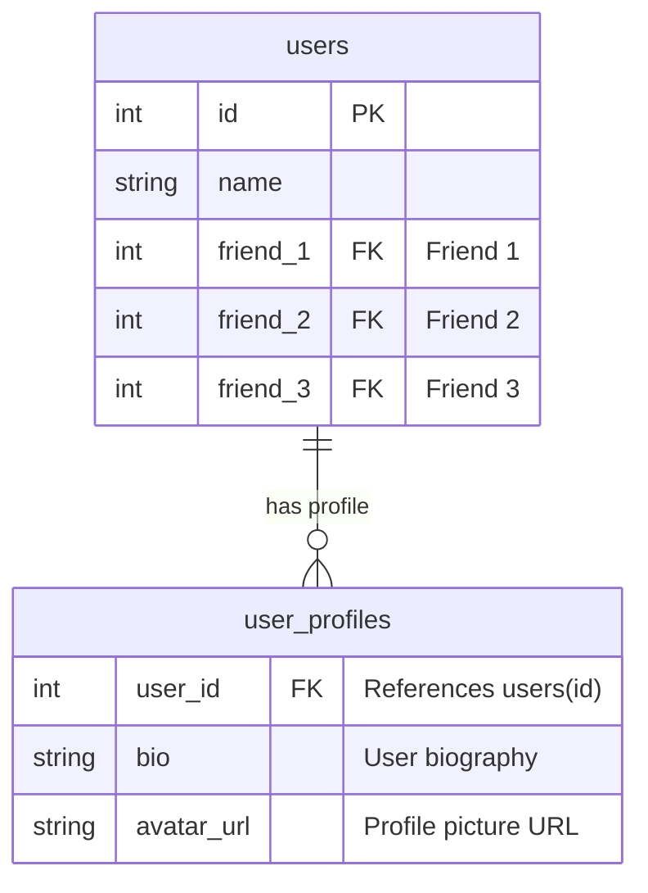

この記事は [SMat Advent Calendar 2024](https://qiita.com/advent-calendar/2024/s-mat) の12月11日分の記事です。

こんにちは。エスマットエンジニアの金尾です。
皆さんはリポジトリパターンでつらい思いをしたことはありますか？　僕はあります。
本記事はそもそもリポジトリパターンとはどういう実装パターンなのかについて検討した内容をまとめたものです。なお文中に出てくるコードはGo言語を前提としています。

## リポジトリパターンとは

リポジトリパターンとは、ドメインモデルのデータ処理をアプリケーションの他の部分から分離する実装パターンです。
対応するドメインモデルのCRUDや集計のメソッドを提供し、データストレージに関する処理をカプセル化します。


*各クライアントは、データストレージのマッピング処理を考えずにUserモデルを利用できる*

## なぜリポジトリパターンを使うのか

リポジトリパターンを使うことによって以下のメリットが期待できます。

- ドメインモデルのデータ処理の統一的なインターフェースを提供する
- ドメインモデルのデータ処理を隠蔽できる
- ドメインモデルのデータ処理をアプリケーション内で一元化する

### 統一的なインターフェースを提供する

ドメインモデルのデータ操作を抽象化し、統一的なインターフェースを提供します。これによりアプリケーションの他の部分からはデータ取得の詳細（SQLクエリやAPIリクエストなど）を意識する必要がなくなり、ドメインモデルを簡単に扱うことができます。

```go
// Userを扱うリポジトリ
type UserRepository

// 全件取得
func (r *UserRepository) FindAll() ([]*User, error) 

//　ID指定で取得
func (r *UserRepository) FindByID(id string) (*User, error) 

// 保存
func (r *UserRepository) Save(u *User) (User, error) 

// ID指定で削除
func (r *UserRepository) Delete(id string) (User, error) 
```

### データ処理を隠蔽できる

　データストレージへのアクセス方法をカプセル化します。これにより、SQLクエリや外部APIの詳細を隠し、変更の影響範囲を限定できます。
パフォーマンスに合わせたチューニングやキャッシュの導入も、リポジトリ内で管理することで、クライアントコードへの影響を最小限に抑えつつ柔軟な対応が可能になります。

```go:アプリケーション側のコード
type User struct {
    ID     string
    Name   string
    Profile Profile
    Friend []*User
}

user, _ := userRepository.FindByID("xxx")
userRepository.Save(user)
userRepository.Delete(user)
```


*リポジトリは、背後にあるデータ構造を隠蔽する。※ドメインモデルの構造と一致している必要はない*


*たとえばfriendを横持ち→縦持ちに変換したとしてもアプリケーション側のコードに影響を与えないように修正できる*

### データ処理を一元化する
データ操作のロジックをリポジトリ内に集約することで、コードの重複を減らし、アプリケーション全体でドメインモデルに関するデータ処理を一貫性を持って行えます。

## つらくなるリポジトリパターン

リポジトリパターンは非常によく使われる実装パターンのひとつですが、　＝一口にリポジトリパターンといってもその書きようは千差万別いろいろあります。どのようなときにつらくなるのかをまとめてみました。

### DBテーブルごとにリポジトリ

世の中にはテーブル構造とstructを簡単にマッピングしてくれるライブラリがあります。シチュエーションが噛み合えばとても便利なのですが、このようなテーブルごとにその構造を模したstructをそのまま使って作成されたリポジトリはつらいです。


*テーブルごとに作成されたリポジトリ。各クライアントは自身の処理に必要なリポジトリをチェリーピックする。*

#### なにがつらいのか

usersテーブルが複数の関連テーブルを持っている場合にもそれに対応するリポジトリが作られます。
それらは往々にして同じようなタイミングで利用されるため、利用するサービス等に対し大量のDIが必要になります（いわゆるconstructor over injection)

```go

func NewXxxUseCase(
    userRepository,
    userAddressRepository,
    userProfileRepository,
    userProfileRevisionRepository,
)

func NewYyyUseCase(
    userRepository,
    userAddressRepository,
    userProfileRepository,
    userProfileRevisionRepository,
)

```

他にも、テーブル構造が露出しているため、アプリケーション側のコードが修正の影響をもろに受けます。
先ほどのusersのfriend縦持ち→横持ちの例だと、FriendRepositoryを追加してまわる必要があります。

```go
// 当然、引数だけでなく内部の実装も変更する必要があるのでつらい

func NewXxxUseCase(
    userRepository,
    userAddressRepository,
    userProfileRepository,
    userProfileRevisionRepository,
    userFriendRepository, // New!!
)

func NewYyyUseCase(
    userRepository,
    userAddressRepository,
    userProfileRepository,
    userProfileRevisionRepository,
    userFriendRepository, // New!!
)

```

また、こうしたリポジトリはデータアクセスのショートカットとしてのみ利用されることが多く、同じユーザーに関する処理であっても統一されたモデルがない場合が多いです（あるならそれを返しているはず）。その場合、各ユースケースに必要なデータのみチェリーピックされ、独自の構造体が定義されることになります。結果、似て非なる構造体があちこちに散在し、認知不可が高まり、つらくなります。


### 暗黙の依存関係

　リポジトリパターンはデータアクセス処理をカプセル化します。しかし、素直にリポジトリのメソッドに沿ったインターフェースを定義すると、時に発生する暗黙の依存関係がつらいです。
リポジトリのインターフェースを作成し、それを要求するユースケースについてみてみます。

```go
type IUserRepository interface {
  FindAll() ([]*User, error)
  FindByID(id string) (*User, error)
  Save(u *User) error
  Delete(id string) error
}

func NewAddFriendUseCase(u IUserRepository) *HogeUseCase {
  return &HogeUseCase{u}
}

func(u *AddFriendUseCase) AddFriend(ctx context.Context, userID, friendID string) error {
  user, err := u.userRepository.FindByID(userID)
  if err != nil {
    return err
  }

  friend, err := u.userRepository.FindByID(friendID)
  if err != nil {
    return err
  }

  user.AddFriend(friend)
  friend.AddFriend(user)

  if err := u.userRepository.Save(user); err != nil {
    return err
  }

  if err := u.userRepository.Save(friend); err != nil {
    return err // userはどうなる？
  }

  return nil
}

```

#### なにがつらいのか

上記のコードでは、二回目のSaveが失敗した際に最初のSave結果をロールバックする必要がありそうです。しかし、IUserRepositoryの具象リポジトリが利用しているストレージがRDBMSか外部マイクロサービスかなどによってロールバック処理が変わりそうですが、クライアントコードからはそれらを判断するための情報がありません。結果、インターフェースを切っているにも関わらず、具象リポジトリ側のコードに合わせて修正する必要があり、抽象化に失敗しています。[^1]

### mockだらけ

　単体テストを書く際に、データストレージが絡むコードをどうテストするかが問題になりがちです。リポジトリのインターフェースがあると、それに対してモックを作成るという方法があります。しかしリポジトリをただモックに置き換えただけではデータの読み書きに対する担保がなされないため、テスト戦略がないとただモックのためのテストをしている、という状態になりがちです。
また、複雑な取得条件がある場合、モック作成そのものの難易度が高くなり、「モックのための実装をしている」という状態にしばしば陥ります。

```go
// 先述のユースケースも、repositoryをモックで置き換えるには
// FindByID,Saveを作り込む必要がありつらい。
// DBの書き込みまではテストできていないのでテストしたい内容に対しコスパが悪そう。
func(u *AddFriendUseCase) AddFriend(ctx context.Context, userID, friendID string) error {
  user, err := u.userRepository.FindByID(userID)
  if err != nil {
    return err
  }

  friend, err := u.userRepository.FindByID(friendID)
  if err != nil {
    return err
  }

  user.AddFriend(friend)
  friend.AddFriend(user)

  if err := u.userRepository.Save(user); err != nil {
    return err
  }

  if err := u.userRepository.Save(friend); err != nil {
    return err 
  }

  return nil
}

// 単にAddFriendそのものか外部依存のない関数に置き換えて
// そちらをテストし、別途DBテストをした方がよいのでは？
func(u *AddFriendUseCase) AddFriend(ctx context.Context, userID, friendID string) error {
  user, err := u.userRepository.FindByID(userID)
  if err != nil {
    return err
  }

  friend, err := u.userRepository.FindByID(friendID)
  if err != nil {
    return err
  }

  // AddFriendServiceに対しテストを書く
  user, friend := u.AddFriendService(user, friend) 
  
  if err := u.userRepository.Save(user); err != nil {
    return err
  }

  if err := u.userRepository.Save(friend); err != nil {
    return err
  }

  return nil
}

```

さらに、先の「DBテーブルごとにリポジトリ」などと悪魔合体するとリポジトリそのものの分量が多いため、プロダクトコード内がモックだらけになります。結果シグネチャが同じがためgrepしても地引網漁のように目当て以外の関連コードがひっかかるようになります。その都度モックコードかinterfaceか実コードかを判別する必要があり、エディタの補完も効きにくくなるため、つらくなります。

## リポジトリパターンとは何でないのか？

リポジトリパターンはドメインモデル-データをマッピングするためのファサードとしてはうまく機能します。一方で以下のような使われ方は本来の問題の解決策としては適切ではなく、より慎重に判断する必要がありそうです。

### データ処理を楽にする

　その側面はありますが、ドメインモデルを設計せずORMをラップしただけのようなリポジトリを作成してしまうと、オーバーヘッドを追加するだけにとどまらず、本来の機能を制限することにもなるでしょう。データベースアクセスへの糖衣構文が必要なのであれば、ORMをそのまま使うことを検討した方がよいかもしれません。

### データストレージを自由に取り替え可能にする

　データ処理をカプセル化することにより、一定の変更への自由度を与えてくれますが、データストレージを自由に変更できる、というのは現実問題として難しいです。トランザクションを意識しないと破壊的変更になる場合があります。複数のデータストレージを扱うアプリケーションであれば、あるリポジトリがどのデータストレージに依存しているのかを明確にしておく必要があるでしょう。

### データ処理の自動テストを容易にする

　モックに差し替えただけでは、データ処理が本当に正しいかをテストすることはできません。一部クライアントコードの単体テスト作成負荷は下がるかもしれませんが、アプリケーション全体でみるとデータの読み書きのテストは避けては通れず、最終的には担保するためテスト戦略が必要になります。

## まとめ

つらくなるリポジトリパターンを見てきましたが、結局のところ適切なリポジトリパターンを運用するには、適切なドメインモデルを設計する必要があります。当然、検討した結果ストレージ差し替えやモックを使う判断はありえますが、しばしば過剰適応に陥りがちです。それらについては別途しっかりと設計する必要あります。設計は当然つらい作業なので「つらくないリポジトリパターンなどない」という結論になりそうです。今日も歯を食いしばってお仕事頑張りましょう。

## 参考文献
- https://bliki-ja.github.io/pofeaa/Repository
- 

[^1]: リポジトリメソッド内部でトランザクションを完結させる手法や、単一のトランザクションで複数の集約を扱うべきではない、という議論もある（IDDDなど）。それはそれでつらい。
